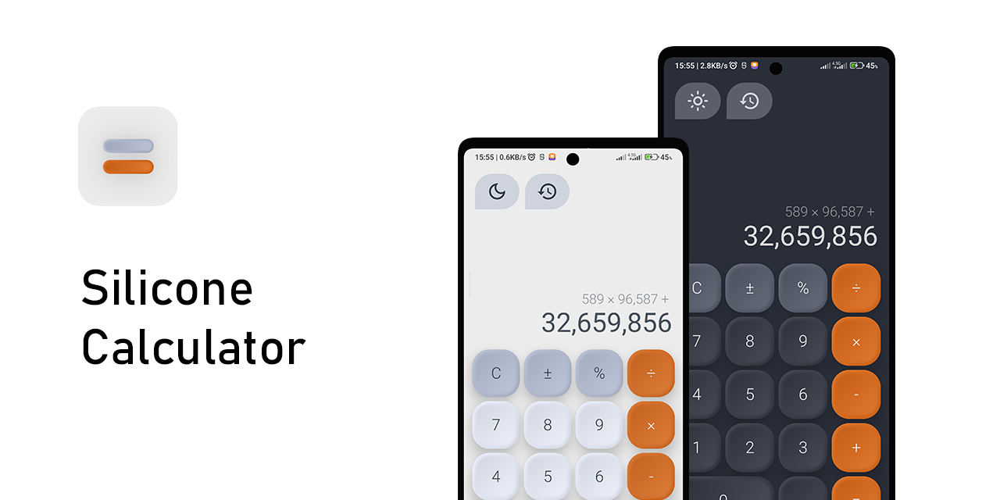
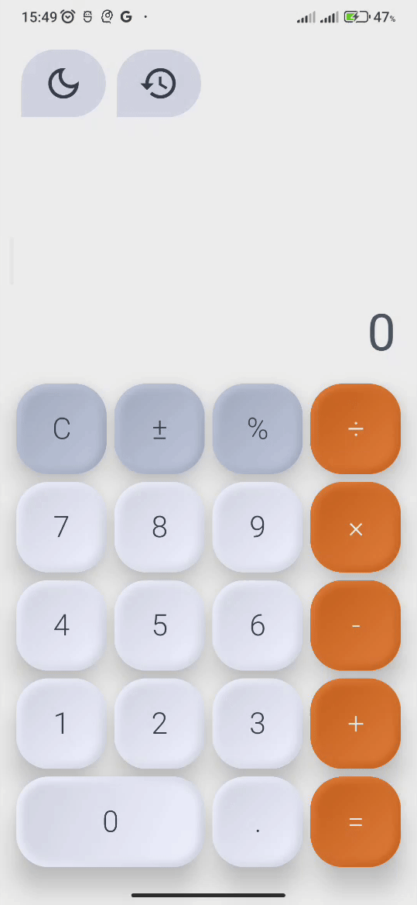
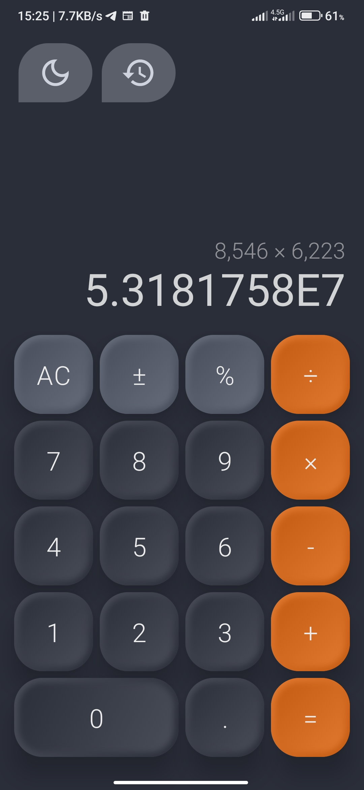
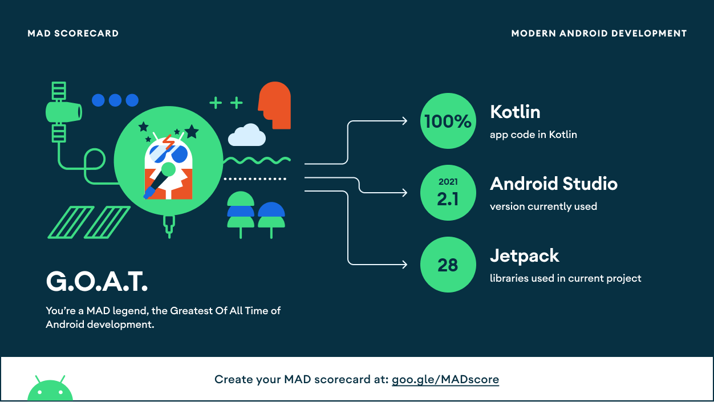

<p align="center">
  <a href="https://opensource.org/licenses/Apache-2.0"></a>
  <a href="https://android-arsenal.com/api?level=21"></a>
  <a href="https://android-arsenal.com/api?level=21"></a>
</p>

It's a cloned version of the [Apple calculator](https://apps.apple.com/us/app/calculator/id1069511488) with [Jetpack Compose](https://developer.android.com/jetpack/compose), but with more attractive graphics, history for calculations, and dark and light theme support.

Design by [SINTHAI](https://www.behance.net/gallery/130717085/The-calculator-) with a slight change.

## 📷 Preview
<p align="center">
  
  
  
</p>

## 🏛️ Architecture
The architecture used in this project is [Android recommended architecture](https://developer.android.com/courses/pathways/android-architecture),
which I personally believe is a combination of some layers and principles of three architectures MVVM, MVI and Clean, which makes it great.

## 🧪 Testing
For this project, **unit**, **integration**, **end-to-end** tests have been written based on the pyramid test in the Android test [codelab](https://developer.android.com/codelabs/advanced-android-kotlin-training-testing-test-doubles#2), and in addition,
a **benchmark** test has been written for the app startup states to measure the effectiveness of using the Baseline Profile.

## 🛠️ Tech Stack
- **UI layer**
    - Jetpack Compose
    - ViewModel component
    - Constraint Layout
    - Compose Navigation
    - Material 2
    - Accompanist system UI controller
- **Data layer**
    - Room database
    - Dagger Hilt
    - Kotlinx Coroutine
    - Mxparser
    - Kotlinx datatime
- **Testing**
    - Truth
    - Turbine
    - Mockk
    - Robolectric
    - Androidx Benchmark
- **Other**
    - Profiler
    - Desugar jdk libs

## 💯 MAD Score


## License
```
Copyright 2022 Erfan Sn
Licensed under the Apache License, Version 2.0 (the "License");
you may not use this file except in compliance with the License.
You may obtain a copy of the License at

    http://www.apache.org/licenses/LICENSE-2.0

Unless required by applicable law or agreed to in writing, software
distributed under the License is distributed on an "AS IS" BASIS,
WITHOUT WARRANTIES OR CONDITIONS OF ANY KIND, either express or implied.
See the License for the specific language governing permissions and
limitations under the License.
```
